# Costa Rica Crime & Socioeconomic Analysis (2015–2025)

* **Author:** Randy Agüero Bermúdez

* **Role:** B.S. in Computing (Computer Science), University of Costa Rica


## Project Overview


This project is a remake of an old project I originally built for a university course called **"Análisis de Grandes Volúmenes de Datos" (Big Data Analysis)**. The first version had some problems with methodology and how the data was interpreted. I decided to rebuild this project from scratch to fix those past mistakes, improve the data pipeline, and create a better analysis.

The goal is to perform an exploratory analysis of crime trends in Costa Rica between 2015 and 2025 using public crime records from the Organismo de Investigación Judicial (OIJ), demographic data from INEC, and socioeconomic indicators from the World Bank.

The project includes data cleaning, visualization, crime-rate normalization, correlation analysis, and regression modeling to explore potential relationships between crime patterns, demographic characteristics, and socioeconomic conditions.

Due to the limited contextual information available in the public datasets, individual incidents cannot be examined in detail. Therefore, the data should be interpreted as an aggregated collection of crimes reported and recorded by the OIJ during the study period. The objective is not to determine causality but rather to identify temporal patterns, geographic differences, and potential relationships between crime rates and demographic indicators across Costa Rican provinces.

### Key Findings

- Crime patterns vary considerably across provinces.
- Coastal provinces, particularly **Limón** and **Puntarenas**, consistently exhibit higher homicide, robbery, and theft rates.
- Vehicle-related crimes have become increasingly important in provinces such as **Heredia** and **Alajuela**.
- Homicide follows a different trajectory from most other crimes, increasing steadily after 2019.
- Population growth shows stronger associations with crime rates than population density.
- Several socioeconomic indicators display moderate to strong correlations with crime rates; however, many of these relationships weaken after controlling for temporal trends through regression analysis.
- Vehicle theft and vehicle breaking and entering show the strongest evidence of sensitivity to short-term economic changes.

### Main Technologies
- Python
- Pandas
- NumPy
- Matplotlib
- Seaborn
- Statsmodels
- OpenRefine
- Jupyter Notebook

### Analytical Techniques
- Exploratory Data Analysis (EDA)
- Data Visualization
- Crime Rate Normalization
- Correlation Analysis
- Regression Analysis
- Trend Analysis

## Requirements

This project uses Python and the `uv` package manager.

### Create a virtual environment

```bash
uv venv
```

### Activate the virtual environment

**Linux / macOS**

```bash
source .venv/bin/activate
```

**Windows (PowerShell)**

```powershell
.venv\Scripts\Activate.ps1
```

### Install dependencies

```bash
uv pip install -r requirements.txt
```


## Data Sources

Because the data files are too large for GitHub, the complete processed datasets are saved in Google Drive and can be accessed here: **[Project Datasets Repository](https://drive.google.com/drive/u/0/folders/1LokpJjgchbPH62Q2NzNoRzVOeMNlTEsb)**.

The data used in this project is public and was collected from national and international institutions:

* **Crime Dataset:** Collected from the open data portal of the **Organismo de Investigación Judicial (OIJ)** of Costa Rica \[[1](https://sitiooij.poder-judicial.go.cr/index.php/ayuda/servicios-policiales/servicios-a-organizaciones/indice-de-transparencia-del-sector-publico-costarricense/datos-abiertos) . This data covers the years 2015 to 2025. **OpenRefine** was used to clean and merge the files.
* **Demographic Data:** Sourced from the Costa Rican **Instituto Nacional de Estadística y Censos (INEC)** website \[[3](https://inec.cr/estadisticas-fuentes)\] to get population numbers.
* **Socioeconomic Indicators:** Downloaded from the **World Bank Database** \[[4](https://data.worldbank.org/country/costa-rica)\] to add macroeconomic context for the regression analysis.

## 1. Data Wrangling & Preprocessing
Before conducting statistical modeling, a comprehensive data wrangling process was performed to ensure data quality, consistency, and integrity across all data sources.

For more detailed information, the processing code and OpenRefine configuration files are available here:

* [Data Wrangling Jupyter Notebook](notebooks/01_data_wrangling.ipynb)
* [OpenRefine Cleaning History](notebooks/openrefine_history.json)

### Data Cleaning & OpenRefine Pipeline
--- 

To handle the large volume of raw crime records obtained from the Organismo de Investigación Judicial (OIJ), the initial phase of the data pipeline was executed in OpenRefine. This reproducible cleaning workflow focused on standardizing geographic categories, normalizing text fields, and explicitly parsing date values.

* **Text Standardization & Clustering:** 
  * Corrected spelling inconsistencies, excess whitespace, and missing accent marks in geographic names to ensure consistent location identifiers across the dataset.
  *  Standardized international country names in the nationality field to ensure consistent naming conventions across all records.
* **Case Normalization:** Standardized text fields by converting all values to Title Case, ensuring consistent formatting across datasets and preventing duplicate categories caused by inconsistent capitalization.

* **Date Parsing:** 
  * Transformed the raw text field `Fecha` into a standardized ISO date format.

### Data Integration
--- 
Following the initial cleanup in OpenRefine, the datasets were imported into Python for final aggregation, alignment, and formatting:

* Dataset Reconstruction & Integration:
  * Historical datasets spanning an 11-year period (2015–2025) were merged into a unified dataframe.
  * Due to structural inconsistencies and missing records in the original open-data portal export, the datasets for 2020, 2021, 2022, and 2025 were processed separately. These cleaned and synchronized subsets were subsequently used to replace the corresponding unaligned sections of the primary crime dataset.

* Date Parsing
  * The standardized `Fecha` field was split into separate temporal features: `Año` (Year), `Mes` (Month), and `Dia` (Day), enabling temporal aggregation and analysis.

* Data Quality Filtering
  * Records containing blank or corrupted values in critical temporal fields, such as missing month values, were removed to preserve statistical integrity.

* Dataset Translation
  * To facilitate international analysis and visualization, all column names and categorical values across the crime, demographic, and socioeconomic datasets were translated from Spanish into English.


## 2.Exploratory Data Analysis (EDA)

The crime dataset contains reports from January 2015 through December 2025 and covers six major crime categories:

* Assault
* Theft
* Robbery
* Homicide
* Vehicle Theft
* Vehicle Breaking and Entering (Tacha de Vehículos)

These categories represent the most frequently tracked offenses in Costa Rica and form the basis of the temporal, geographic, demographic, and socioeconomic analyses presented in this project.

For additional information about the datasets, data preparation process, and exploratory analysis, see:

* [Exploratory Data Analysis Jupyter Notebook](notebooks/02_exploratory_data_analysis.ipynb)

### National Crime Trends
---

<p align="center">
  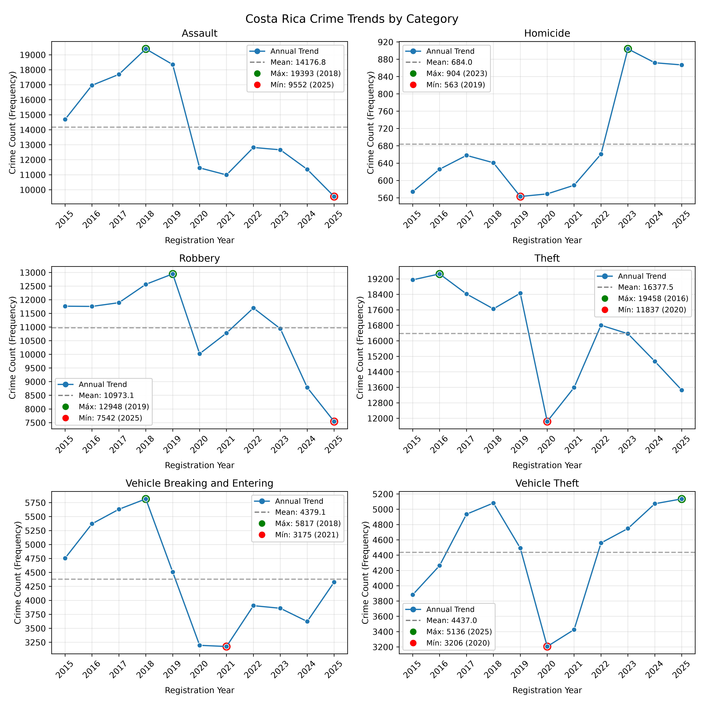
</p>

At the national level, property crimes (including theft, robbery, assault, vehicle theft, and vehicle breaking and entering) remain the most frequently reported offenses throughout the study period. These categories consistently account for the majority of recorded crime reports and largely define the overall national crime profile.

Homicide represents only a small proportion of total reported crimes. However, despite its relatively low frequency, it has a disproportionate social impact due to its severity. Unlike most other crime categories, homicide displays a clear upward trend beginning in 2019. This increase becomes particularly pronounced after 2021, culminating in 2023, which records the highest number of homicide reports in the dataset.

A major structural break is visible around 2020, coinciding with the COVID-19 pandemic and the implementation of mobility restrictions. Most crime categories experienced a noticeable decline during this period, followed by varying degrees of recovery in subsequent years. However, this recovery was not uniform across offenses. Vehicle theft returned to levels comparable to those observed before the pandemic, while theft, robbery, and assault generally remained below their pre-2020 peaks. Homicide was the principal exception to this pattern, as it did not experience the same decline observed in other crime categories and instead continued its upward trajectory.

Vehicle theft displays sustained growth during the later years of the dataset, contrasting with the declining trends observed for assault, robbery, and theft. The steady increase in vehicle theft reports suggests a gradual shift in the composition of criminal activity.

### Crime Trends by Provinces
---

Direct comparisons of crime counts across provinces can be misleading because provinces differ substantially in population size. To enable meaningful comparisons, crime counts were normalized using annual population estimates.

For each province and year, crime rates were calculated per 100,000 inhabitants using the following formula:

```text
Crime Rate = (Number of Crimes / Population) × 100,000
```

This approach combines the annual crime records with provincial population data and standardizes crime levels across provinces. As a result, the analysis reflects the relative prevalence of crime rather than absolute crime counts, allowing provinces with different population sizes to be compared on an equal basis.

The following analysis examines trends in crime rates across provinces and crime categories, highlighting regional differences that may not be visible when using raw crime counts alone.

#### Assault
---
<p align="center">
  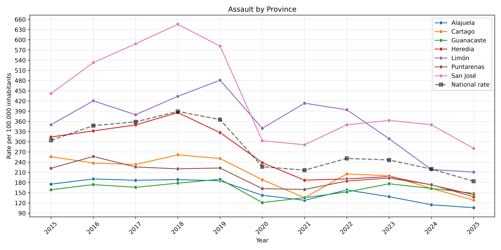
</p>

Assault rates are consistently highest in San José and Limón, both of which remain above the national average throughout most of the study period. However, from 2023 onward, assault rates begin to decline across the majority of provinces, suggesting a recent nationwide reduction in this category of crime.

#### Vehicle-related crimes
---

<p align="center">
  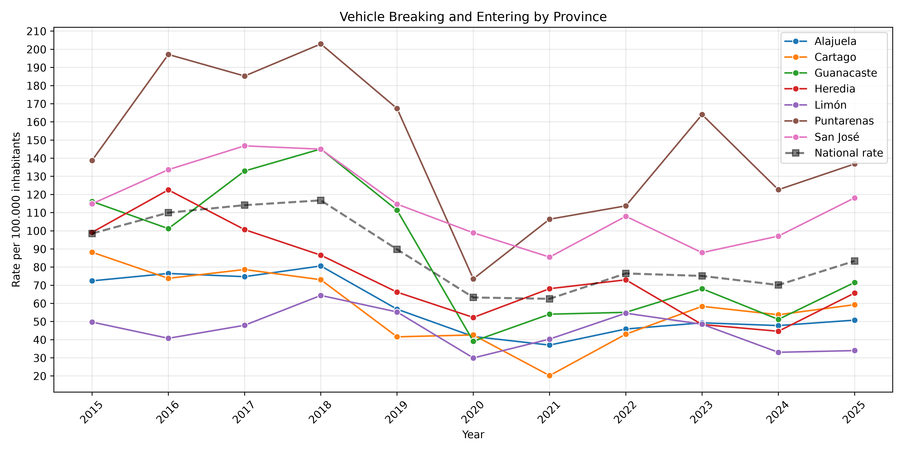
</p>

<p align="center">
  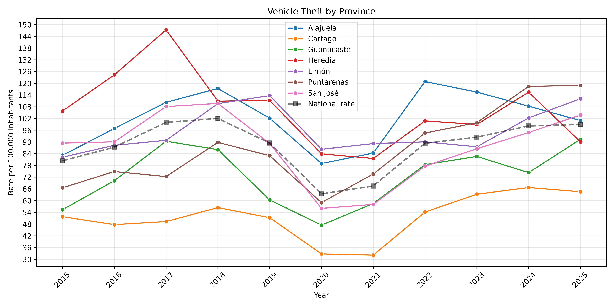
</p>

Vehicle-related crimes show clear differences between provinces. Heredia and Alajuela consistently have higher rates of vehicle theft than the other provinces. This suggests that vehicle theft is an important part of the crime trends in these areas. 

Puntarenas stands out for vehicle breaking and entering, with the highest rates among all provinces. This shows that this type of crime is more concentrated in Puntarenas than in the rest of the country.

#### Robbery
---
<p align="center">
  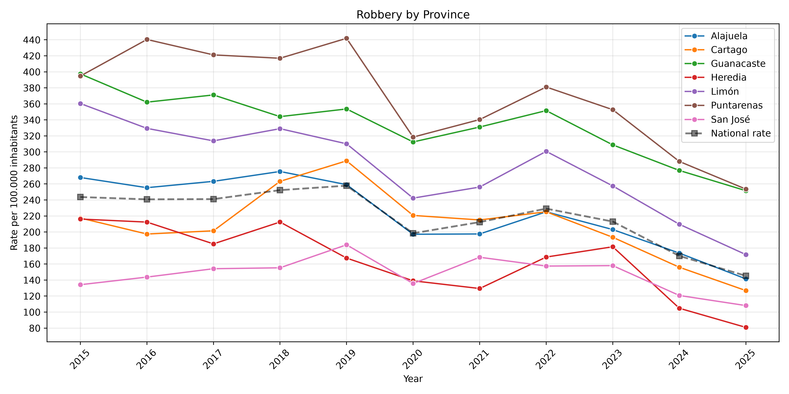
</p>
Robbery rates are also disproportionately high in coastal regions. This pattern reinforces the broader observation that several crime categories exhibit higher rates outside the Central Valley, particularly in provinces with significant tourism activities.

#### Homicide
---
<p align="center">
  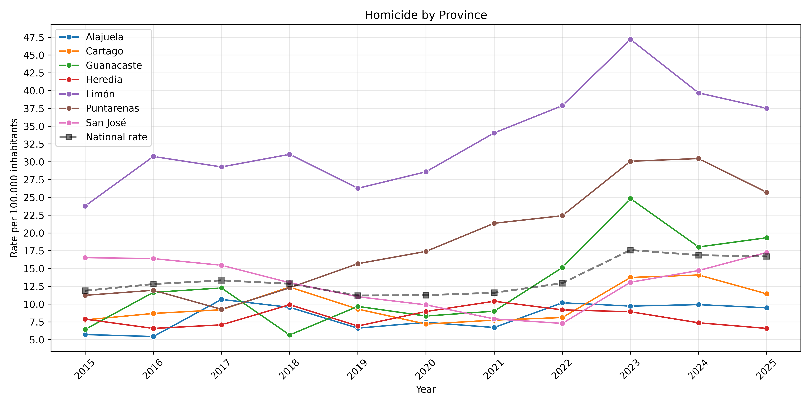
</p>
Homicide displays a markedly different geographic pattern from other offenses. The highest homicide rates are concentrated in coastal provinces, and this disparity becomes increasingly pronounced during the later years of the dataset. The upward trend in homicide rates contrasts with the declining or stable patterns observed in several other crime categories.

#### Theft
---

<p align="center">
  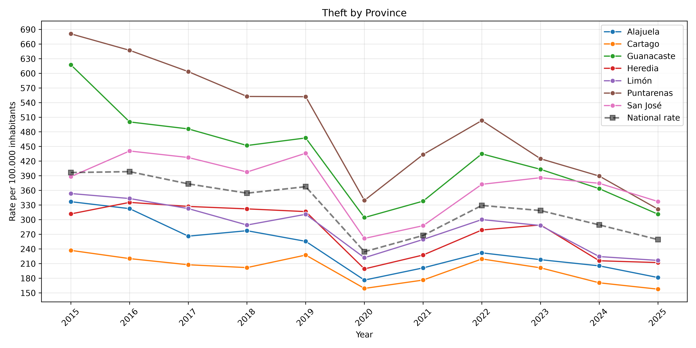
</p>

Theft exhibits a similar spatial distribution to homicide. Coastal provinces generally record higher theft rates than provinces in the Central Valley, despite the overall national decline in theft observed after 2020. This suggests that regional factors continue to influence property crime even as national trends improve.

#### Crime Trends Summary
---
The rate analysis reveals persistent regional disparities in crime across Costa Rica. Even after adjusting for population size, coastal provinces consistently exhibit higher rates of homicide, theft, and robbery than many provinces in the Central Valley. In contrast, provinces such as Heredia and Alajuela display comparatively high rates of vehicle theft, while Puntarenas stands out for vehicle breaking and entering.

These patterns demonstrate that crime is not distributed uniformly across the country. While population size influences the total number of reported crimes, normalizing by population shows that certain provinces experience disproportionately high crime rates in specific categories. The findings highlight the importance of regional factors when examining crime trends and suggest that crime dynamics vary considerably across provinces and offense types.


### Provincial Crime Composition
--- 

This section examines the composition of crime in each Costa Rican province between 2015 and 2025. Instead of focusing on the total number of crimes, the analysis explores the relative share of each crime category within the provincial crime profile. This approach makes it possible to identify which types of crime are most common in each province and how their importance changes over time. Comparing crime composition across provinces helps reveal regional differences that may not be visible when analyzing crime rates alone.

#### Alajuela
---
<p align="center">
  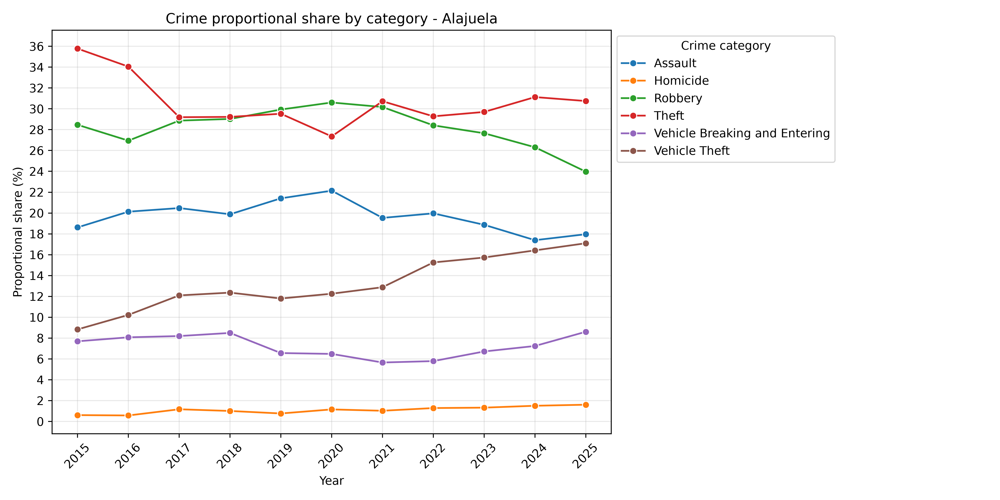
</p>

Alajuela shows a noticeable increase in vehicle-related crimes over time. While traditional property crimes remain significant, vehicle theft and vehicle breaking and entering become increasingly important components of the provincial crime structure.

#### San José
---
<p align="center">
  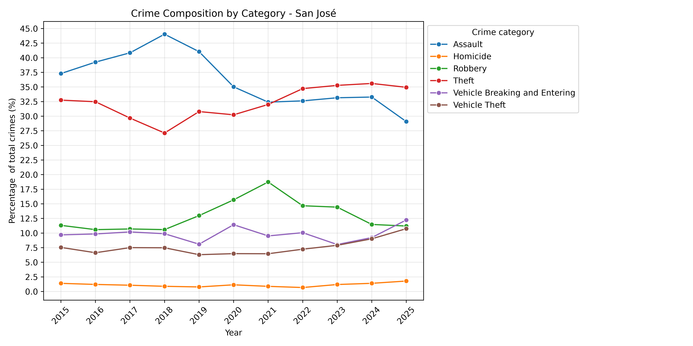
</p>
San José exhibits a diverse crime profile, with property crimes remaining dominant throughout the study period. The proportional shares of assault and robbery decline over time, while homicide remains relatively stable. Meanwhile, vehicle-related crimes become increasingly important components of the province's crime composition.

####  Limón
---


<p align="center">
  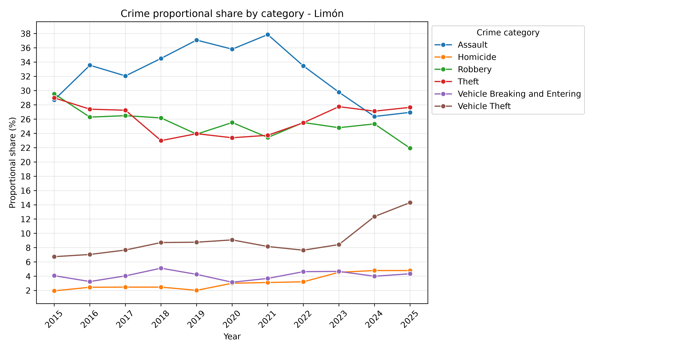
</p>
Limón exhibits one of the most distinctive crime profiles among all provinces. Assault has declined sharply since 2021, while robbery, theft, and vehicle breaking and entering have remained relatively stable. In contrast, vehicle theft has increased substantially since 2023. The most notable change is observed in homicide, whose share of total reported crimes increased from approximately 2% in 2015 to nearly 4% in 2025, effectively doubling over the study period.

#### Puntarenas
---
<p align="center">
  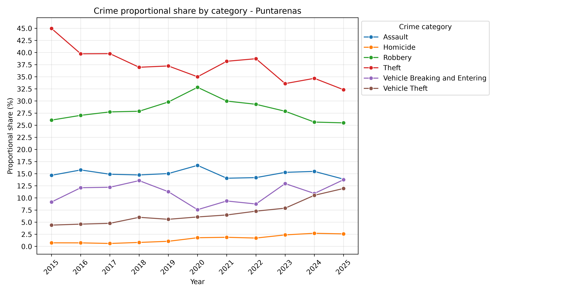
</p>


Puntarenas shows a declining share of theft but increasing proportions of homicide and vehicle-related crimes. Assault trends gradually upward, while robbery remains relatively stable apart from a temporary spike around 2020. Similar to Limón and Guanacaste, homicide becomes a more prominent component of the province's crime profile over time.

<p align="center">
  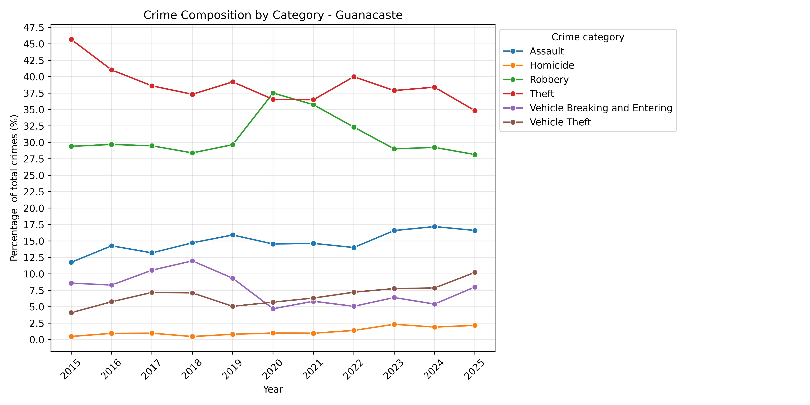
</p>

#### Guanacaste

Guanacaste maintains comparatively lower assault rates than most provinces. Theft and robbery remain the dominant categories, and the overall composition of crime remains relatively stable across the study period.

#### Cartago
---
<p align="center">
  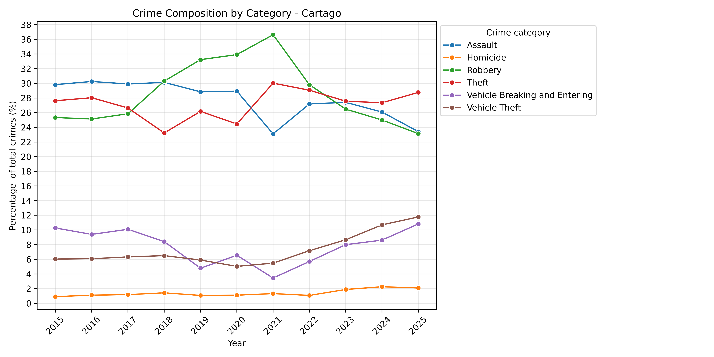
</p>


In Cartago, Vehicle theft and vehicle breaking and entering increase their relative importance, while robbery, theft, and assault lose share after 2022. This suggests a gradual shift in the province's crime profile.

#### Heredia
---
<p align="center">
  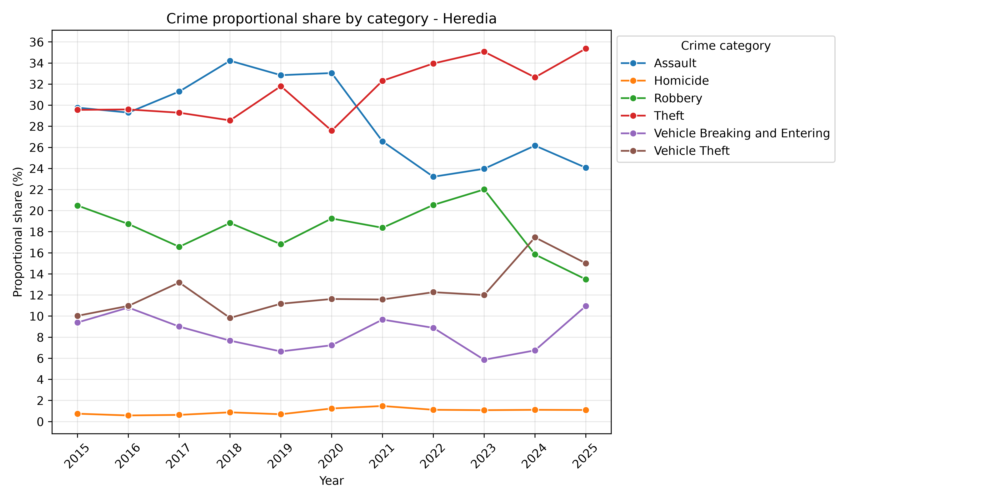
</p>

Heredia exhibits a diverse crime composition, with assault and theft representing the largest shares of reported crimes. Around 2021, assault surpasses theft as the dominant category as theft's share declines. Robbery remains relatively stable before decreasing after 2023, while homicide maintains a consistently low proportion. Vehicle theft and vehicle breaking and entering show the greatest variation over time, highlighting the growing importance of vehicle-related crimes in the province.


### Crime Trends Summary
---
At the national level, property crimes remain the most common type of reported crime, although their rates generally decrease after 2020. Theft, robbery, and assault all declined after the COVID-19 period and have not returned to their pre-pandemic levels. In contrast, vehicle theft shows continued growth in the later years of the study period, while homicide begins to increase around 2019 and reaches its highest levels in recent years.

When crime rates are adjusted for population size, important regional differences become clear. Coastal provinces, especially Limón and Puntarenas, consistently record higher rates of homicide, theft, and robbery than many provinces in the Central Valley. Meanwhile, vehicle-related crimes are more common in provinces such as Heredia and Alajuela, while Puntarenas records the highest rates of vehicle breaking and entering. These results show that crime patterns vary across regions and cannot be explained by population size alone.

The crime composition analysis also shows that the structure of crime has changed over time. In several provinces, theft and robbery represent a smaller share of total crime, while vehicle-related offenses become more important. In some provinces, especially Limón, homicide also accounts for a larger share of reported crimes. This suggests that changes in crime patterns are not only related to the total number of crimes but also to changes in the importance of different crime categories.

Overall, the analysis highlights three main findings. First, crime trends differ across provinces, showing the importance of regional analysis. Second, vehicle-related crimes have become more important in several parts of the country. Third, homicide follows a different pattern from most other crimes, showing continuous growth while many property crimes remain stable or decline.

## 3. Crime Trends and Demographic Indicators

This section investigates how demographic characteristics relate to crime rates across Costa Rican provinces. Two demographic indicators are considered: population growth and population density. Crime rates are expressed per 100,000 inhabitants to allow meaningful comparisons across provinces with different population sizes.

Population density and population growth data were obtained from the National Institute of Statistics and Census (INEC) of Costa Rica. Population density was measured using INEC's adjusted density estimates, which account only for habitable or effectively occupied areas and exclude uninhabitable territories. This adjustment provides a more realistic measure of population concentration across provinces. Population growth was expressed as the annual increase in population per 100 inhabitants, following INEC demographic reporting standards.

These demographic indicators were selected to examine whether differences in population concentration and demographic expansion are associated with variations in provincial crime rates. Crime rates were standardized and expressed per 100,000 inhabitants to ensure comparability across provinces with different population sizes.


### 3.1 Demographic Correlation Analysis

To explore the relationship between crime and demographic factors, Spearman rank correlations were calculated between crime rates and demographic indicators for each province.

Spearman correlation was selected for three reasons:

* It captures monotonic relationships, whether linear or non-linear.
* It is less sensitive to extreme observations than Pearson correlation.
* It does not require variables to follow a normal distribution.

**Annual crime growth was excluded from this analysis because it is highly correlated with population growth, potentially introducing redundancy into the interpretation.**


#### San José
---
<p align="center">
  
</p>
The strongest demographic relationships are observed for assault and theft. Both crimes exhibit positive correlations with population growth and negative correlations with population density. These results suggest that periods of stronger population growth tend to coincide with higher assault and theft rates, while higher population density is associated with lower rates of these crimes.

#### Alajuela
---
<p align="center">
  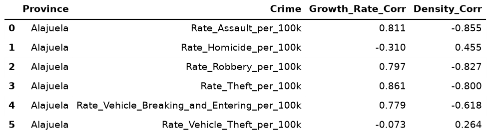
</p>
Alajuela displays some of the strongest demographic relationships in the dataset. Assault, robbery, theft, and vehicle breaking and entering all show strong positive correlations with population growth and strong negative correlations with population density. This indicates that demographic changes are closely associated with fluctuations in property crime rates within the province.

#### Puntarenas
---
<p align="center">
  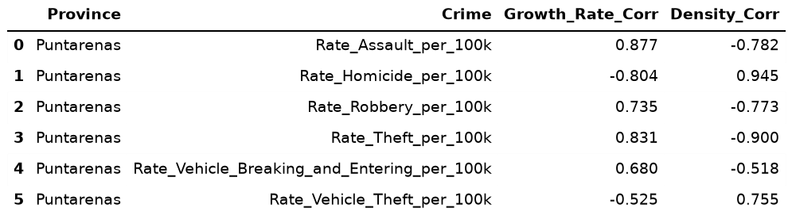
</p>
Puntarenas presents a distinctive pattern. Assault, robbery, and theft all exhibit strong positive relationships with population growth and strong negative relationships with population density. Homicide and vehicle theft display the opposite behavior, showing negative correlations with population growth and positive correlations with population density. This suggests that violent crime and vehicle theft may be influenced by different mechanisms than traditional property crimes.

#### Limón
---
<p align="center">
  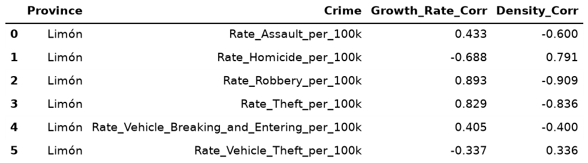
</p>
Limón exhibits particularly strong relationships for robbery and theft. Both crime categories increase alongside population growth and decrease as population density rises. Homicide displays the opposite pattern, suggesting that demographic factors associated with property crime do not affect violent crime in the same way.

#### Guanacaste
---
<p align="center">
  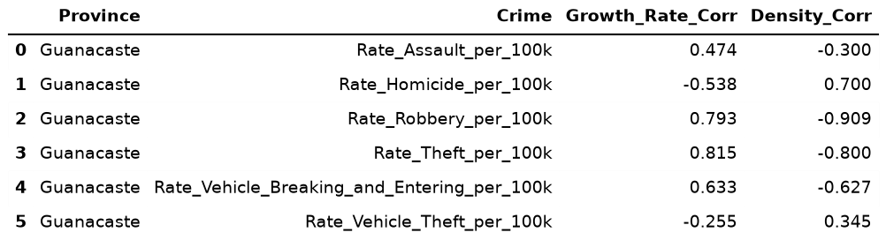
</p>
Robbery and theft show strong positive correlations with population growth and strong negative correlations with population density. Homicide again follows a different pattern, displaying weaker and inverse relationships with the demographic indicators.

#### Heredia
---
<p align="center">
  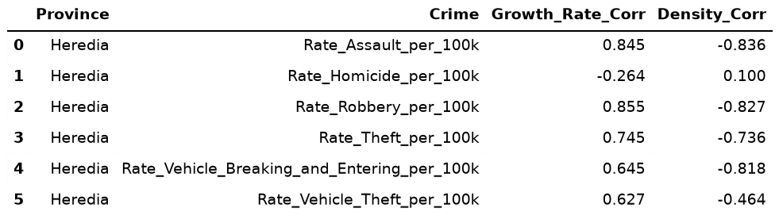
</p>
Assault, robbery, theft, and vehicle breaking and entering all display strong positive correlations with population growth and negative correlations with population density. These consistent relationships suggest that demographic change is strongly associated with property crime variation in the province.

#### Cartago
---
<p align="center">
  
</p>
Cartago exhibits fewer strong demographic relationships than most provinces. Assault demonstrates the clearest association with population growth and population density, while the remaining crime categories display weaker and less consistent patterns.

#### Correlation Analysis Summary
---

Several common patterns emerge across provinces. Property crimes, including assault, theft, robbery, and vehicle-related offenses, are generally positively associated with population growth and negatively associated with population density. Homicide consistently behaves differently, exhibiting weaker or inverse relationships with these demographic indicators. Overall, population growth appears to be more strongly associated with crime variation than population density.

### 3.2 Demographic Regression Analysis
---
While correlation analysis identifies associations between variables, it does not control for differences across provinces or common changes over time. To address these limitations, fixed-effects panel regression models were estimated for each crime category.

The following specification was used:

Crime Rate = β₀ + β₁(Growth Rate)
                  + β₂ log(Population Density)
                  + Province Fixed Effects
                  + Year Fixed Effects
                  + ε

The model includes:

- Province fixed effects, which control for unobserved characteristics that remain constant within provinces over time.
- Year fixed effects, which control for national events or trends that affect all provinces simultaneously.
- Robust (HC3) standard errors, which improve the reliability of statistical inference in the presence of heteroskedasticity.

By controlling for both province-specific and time-specific effects, the model isolates the relationship between demographic indicators and crime rates.

#### Regression Findings
---
<p align="center">
  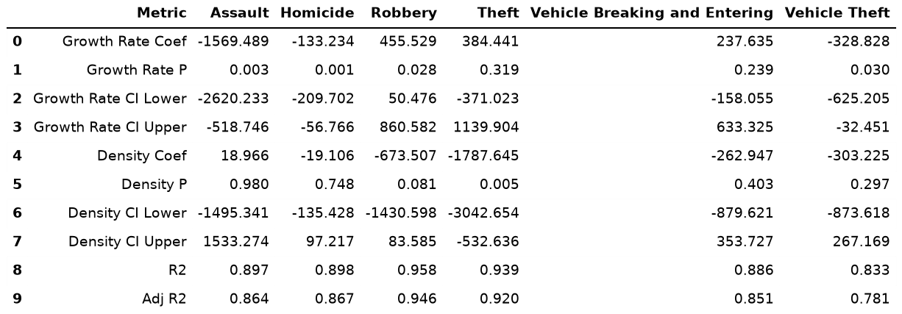
</p>

The regression results largely confirm the patterns identified in the correlation analysis.

* **Population density** is significantly associated with lower rates of several property crimes. In particular, robbery and theft display large negative coefficients, indicating that higher population density is associated with lower crime rates after controlling for provincial and temporal differences.

* **Homicide** exhibits a distinct relationship compared with other crime categories. Population growth is significantly associated with lower homicide rates, reinforcing the observation that homicide responds differently to demographic factors than property crimes.

* **Assault** does not exhibit statistically significant relationships with the demographic indicators once province and year effects are included in the model. This suggests that factors beyond population growth and population density may play a more important role in explaining variations in assault rates.

* The **adjusted R²** values range from approximately 0.78 to 0.95, indicating that the models explain a substantial proportion of the variation in provincial crime rates.

#### Interpretation and Limitations
---
The correlation and regression analyses suggest that demographic factors are associated with differences in crime rates across Costa Rican provinces. Population growth generally shows a stronger relationship with crime rates than population density, particularly for property crimes such as theft, robbery, and vehicle-related offenses. However, these relationships should be interpreted with caution.

Neither the correlation analysis nor the regression models can establish causal relationships. The observed associations do not necessarily mean that changes in population growth or population density directly cause changes in crime rates. Crime is influenced by many social, economic, and institutional factors that were not included in this study, such as policing strategies, tourism activity, and organized criminal activity.

One notable finding is that population growth shows a stronger relationship with crime rates than population density across most provinces. Property crimes tend to increase during periods of higher population growth, suggesting that demographic expansion may be associated with increased opportunities for certain types of crime.

In contrast, several crime categories exhibit negative relationships with population density. These findings may appear unexpected, as areas with higher population concentration are often assumed to provide more opportunities for criminal activity.

Several factors may help explain these results. Costa Rica's most densely populated provinces are located in the Central Valley, where economic opportunities, public services, infrastructure, and police resources are generally more developed than in less densely populated regions. As a result, higher population density may not necessarily correspond to higher crime rates. Additionally, population growth captures changes occurring over time, while population density reflects a more stable characteristic of a province. Rapid population growth may place pressure on housing, transportation, public services, and local institutions, creating conditions associated with increases in certain crimes. In contrast, densely populated provinces may benefit from stronger institutions and greater public investment that help reduce crime opportunities.

The regression models control for province-specific and year-specific effects, which improves the reliability of the results. However, the findings should still be viewed as evidence of statistical association rather than causation. Overall, the results suggest that population growth is more closely associated with crime variation than population density, but the mechanisms behind these relationships remain uncertain. The findings indicate that the relationship between demographic factors and crime in Costa Rica is complex and likely influenced by additional factors not included in this analysis.

## 4. Macroeconomic Trends and National Security
While regional analysis helps understand local crime patterns, national-level analysis provides insight into whether broader socioeconomic conditions are associated with changes in crime rates across Costa Rica. To explore these relationships, a set of national socioeconomic indicators was combined with annual crime rates between 2015 and 2025.

The socioeconomic indicators were obtained from the World Bank Open Data database and merged with national crime rates for the period 2015–2025. The selected indicators were chosen to represent different dimensions of Costa Rica's economic and social conditions.

The indicators included:

* **Unemployment (%):** The percentage of the total labor force that is unemployed but actively seeking employment.
* **Inflation (%):** The annual percentage change in consumer prices, measuring changes in the general cost of living.
* **Poverty Headcount (%):** The percentage of the population living below Costa Rica's national poverty line.
* **Gini Coefficient:** A measure of income inequality ranging from 0 (perfect equality) to 100 (maximum inequality).
* **Education Expenditure (%):** Government expenditure on education expressed as a percentage of total government expenditure.
* **Secondary Completion Rate (%):** The percentage of the relevant population that successfully completes lower secondary education.

### 4.1 Socioeconomic Correlation Analysis
---
To explore the relationship between crime and socioeconomic conditions, Spearman rank correlations were calculated between crime rates and each socioeconomic indicator.

Spearman correlation was selected because it measures monotonic relationships without assuming that the relationship is strictly linear. It is also less sensitive to outliers and is appropriate for datasets with a limited number of observations, such as the annual national data used in this study.

It is important to note that correlation measures association only and does not imply causation. Strong correlations may occur because variables share similar trends over time rather than because one variable directly influences the other.

#### Correlation Findings
---
<p align="center">
  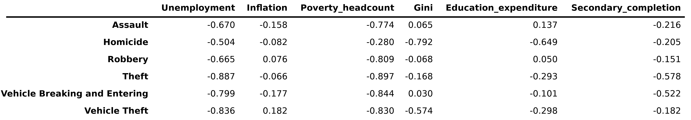
</p>


The correlation analysis reveals notable associations between crime rates and national socioeconomic indicators.

* Poverty headcount exhibits the strongest relationships across most crime categories. Very strong negative correlations are observed for vehicle breaking and entering (-0.937), theft (-0.837), and assault (-0.812). More moderate negative associations are observed for robbery (-0.711) and vehicle theft (-0.678). These results indicate that years with higher poverty levels generally correspond to lower rates of these crimes.

* Unemployment also displays consistent negative associations with crime rates. The strongest relationships are observed for theft (-0.750) and vehicle breaking and entering (-0.683), while homicide (-0.617) and vehicle theft (-0.583) exhibit moderate to strong negative correlations. Assault and robbery show weaker associations.

* Income inequality, measured by the Gini coefficient exhibits a strong negative correlation with vehicle theft (-0.753) and a moderate negative correlation with homicide (-0.636). Correlations with other crime categories are relatively weak.

* Education expenditure exhibits weak correlations across all crime categories, with coefficients generally close to zero. Similarly, secondary school completion displays mostly weak associations, although a moderate negative correlation is observed for theft (-0.583).

* Inflation shows the weakest overall relationships with crime. Most crime categories exhibit weak correlations, suggesting that inflation is not strongly associated with national crime trends during the study period.

* Homicide continues to display a distinct pattern compared with property crimes. While property crimes are most strongly associated with poverty and unemployment, homicide exhibits moderate negative correlations with education expenditure (-0.650), the Gini coefficient (-0.636), and unemployment (-0.617).

#### Correlation Analysis Summary
---
The correlation analysis suggests that several socioeconomic indicators move closely with crime rates over time. However, these relationships should be interpreted cautiously because correlation alone cannot distinguish between direct effects and shared long-term trends. Additional analysis is therefore required to determine whether short-term changes in socioeconomic conditions are associated with changes in crime rates.

### 4.2 Socioeconomic Regression Analysis
---
While correlation analysis shows whether two variables move together, it does not determine whether changes in socioeconomic conditions are associated with changes in crime rates. To further examine these relationships, a series of regression models were estimated.

For each crime category and socioeconomic indicator, year-to-year changes were calculated. The models therefore examine whether annual changes in socioeconomic conditions are associated with annual changes in crime rates.

The following model was used:

Δ Crime Rate = β₀ + β₁(Δ Socioeconomic Indicator) + ε

where Δ represents the change from one year to the next.

Using year-to-year differences helps reduce the influence of long-term trends and focuses on short-term changes. Robust (HC3) standard errors were also used to improve the reliability of the results.

Because the analysis uses national annual data from 2015 to 2025, each model contains a small number of observations. Therefore, the results should be interpreted as exploratory and not as evidence of causal relationships.
#### Regression Findings
---
The regression analysis provides weaker evidence of a relationship between socioeconomic conditions and crime than the correlation analysis.

##### Assault
---
<p align="center">
  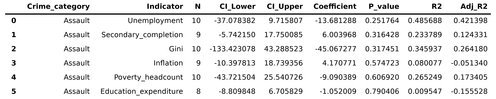
</p>
None of the socioeconomic indicators produce statistically significant coefficients for assault. Although unemployment explains a moderate proportion of variation in assault rates, the estimated relationship remains statistically uncertain. Overall, the regression analysis provides limited evidence that short-term changes in national socioeconomic conditions are associated with changes in assault rates.

##### Homicide
---
<p align="center">
  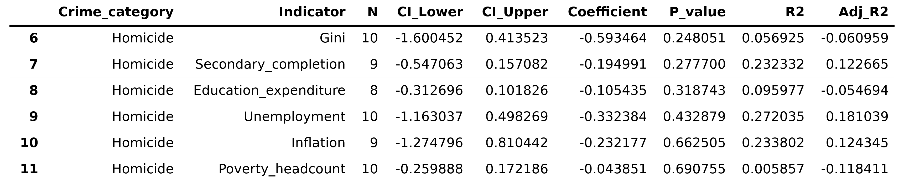
</p>
Homicide exhibits the weakest response to socioeconomic indicators. None of the estimated coefficients are statistically significant, and the explanatory power of the models remains relatively low. These findings suggest that annual changes in homicide rates are not well explained by changes in unemployment, poverty, inequality, inflation, or education-related indicators.

##### Robbery
---
<p align="center">
  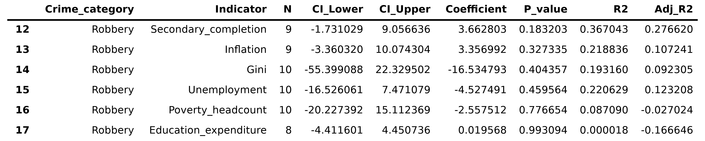
</p>
The robbery models do not identify statistically significant relationships with any socioeconomic indicator. While some variables explain a modest proportion of annual variation, the estimated effects remain uncertain. As a result, there is little evidence that short-term changes in national economic conditions are associated with changes in robbery rates.

##### Theft
---
<p align="center">
  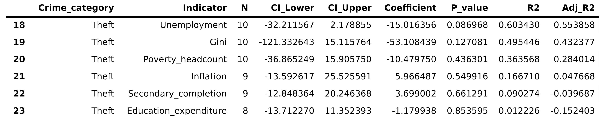
</p>
Theft provides the strongest evidence among the traditional property crimes. Changes in unemployment are negatively associated with changes in theft rates and produce the lowest p-value among the theft models. The unemployment model also explains a relatively large proportion of annual variation in theft rates. However, the relationship does not reach conventional levels of statistical significance, indicating that the evidence remains suggestive rather than conclusive.

##### Vehicle Theft
---
<p align="center">
  
</p>
Vehicle theft exhibits the most consistent relationship with socioeconomic conditions. The regression models identify significant negative associations between vehicle theft and changes in unemployment, while income inequality also appears to be an important predictor. Compared with other crime categories, vehicle theft demonstrates a stronger sensitivity to short-term economic fluctuations.

##### Vehicle Breaking and Entering
---
<p align="center">
  
</p>
Vehicle breaking and entering displays a pattern similar to vehicle theft. Changes in unemployment are significantly associated with changes in crime rates, and the regression models explain a substantial proportion of annual variation. These findings suggest that vehicle-related offenses are more responsive to short-term macroeconomic conditions than other crimes examined in this study.

#### Regression Analysis Summary
---
The regression analysis provides weaker evidence of socioeconomic effects than the correlation analysis. For assault, homicide, and robbery, no statistically significant relationships are identified. Theft exhibits some evidence of association with unemployment, although the relationship remains below conventional significance thresholds. Vehicle theft and vehicle breaking and entering represent the strongest findings, displaying significant relationships with unemployment and, in some models, income inequality. Overall, vehicle-related offenses appear to be the crime categories most responsive to short-term changes in national socioeconomic conditions.

Vehicle-related offenses represent the main exception, showing evidence of sensitivity to short-term economic fluctuations. Overall, the findings provide limited support for a direct relationship between national socioeconomic conditions and crime trends during the study period. The results also suggest that factors beyond the macroeconomic indicators included in this analysis may play an important role in explaining changes in crime rates across Costa Rica.

## 5. Conclusion
The exploratory analysis revealed several important findings. First, crime patterns differ substantially across provinces. Coastal provinces, particularly Limón and Puntarenas, consistently recorded higher rates of homicide, theft, and robbery than many provinces in the Central Valley. In contrast, vehicle-related crimes were more concentrated in provinces such as Heredia and Alajuela, while Puntarenas showed particularly high rates of vehicle breaking and entering.

Second, crime composition changed over time. Traditional property crimes such as theft and robbery generally declined after 2020 and did not fully return to their pre-pandemic levels. Meanwhile, vehicle theft increased during the later years of the study period, and homicide followed a distinct upward trend beginning around 2019. These findings suggest that changes in crime are not only related to overall crime levels but also to shifts in the relative importance of different crime categories.

The demographic analysis found that population growth was generally associated with higher rates of property crime, while population density often showed negative relationships with crime rates. Although some of these findings differ from traditional criminological expectations, the regression results confirmed that demographic factors are associated with several crime categories, particularly theft, robbery, and vehicle-related offenses. However, homicide consistently displayed different behavior and appeared less closely related to the demographic indicators examined in this study.

The socioeconomic analysis produced more mixed results. Correlation analysis identified several moderate and strong associations between crime rates and indicators such as unemployment, poverty, and income inequality. However, most of these relationships became statistically insignificant once year-to-year changes were analyzed through regression models. Vehicle theft and vehicle breaking and entering were the main exceptions, showing greater sensitivity to short-term economic fluctuations. Overall, the findings suggest that many of the observed socioeconomic correlations may reflect shared temporal trends rather than direct relationships.

Several limitations should be acknowledged. The analysis relies on reported crime data and publicly available aggregated datasets, which provide limited contextual information about individual incidents. In addition, the socioeconomic analysis is based on a relatively small number of annual observations, reducing the statistical power of the regression models. Important factors such as policing strategies, organized criminal activity, tourism intensity, migration patterns, and local economic conditions were not included in the analysis.

Overall, the results indicate that crime in Costa Rica is shaped by a combination of regional, demographic, and socioeconomic factors. While demographic indicators appear to explain part of the variation in property crimes, socioeconomic indicators provide weaker and less consistent evidence. The findings highlight the importance of regional analysis and suggest that crime dynamics vary considerably across provinces and crime categories. Future research could incorporate additional social, economic, and institutional variables to better understand the mechanisms driving crime trends in Costa Rica.

An important finding of this study is that several demographic and socioeconomic relationships were contrary to conventional expectations. The correlation analyses frequently identified strong negative associations between crime rates and indicators such as unemployment, poverty, income inequality, and population density. However, the regression analyses generally weakened or eliminated many of these relationships after controlling for provincial differences, year effects, or long-term trends. This suggests that some of the observed correlations may reflect broader temporal patterns rather than direct causal mechanisms. The contrast between the correlation and regression results highlights the importance of using multiple analytical approaches when interpreting crime data.
